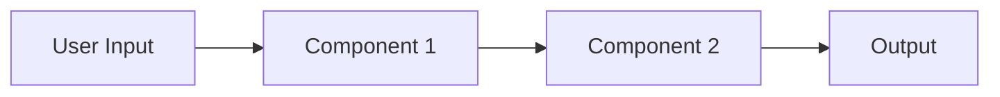

# Implementation Plan

## Overview
High-level approach in 2-3 sentences. What are we building and how?

## Components

### Component 1: [Name]
- **Purpose:** One sentence description
- **Inputs:** What data/events it receives
- **Outputs:** What it produces/emits
- **Dependencies:** Other components it relies on

### Component 2: [Name]
- **Purpose:**
- **Inputs:**
- **Outputs:**
- **Dependencies:**

## Data Flow

## Implementation Sequence

Order matters. Earlier tasks unblock later ones.

1. [ ] **Task 1** - [Description] (no dependencies)
2. [ ] **Task 2** - [Description] (depends on: Task 1)
3. [ ] **Task 3** - [Description] (depends on: Task 1)
4. [ ] **Task 4** - [Description] (depends on: Task 2, Task 3)

## Technical Decisions

| Decision | Choice | Rationale |
|----------|--------|-----------|
| [e.g., State management] | [e.g., Zustand] | [e.g., Simpler than Redux for this scale] |

## Open Questions

- [ ] Question 1 (default assumption: X)
- [ ] Question 2 (blocked on: [what])

## Out of Scope

Items explicitly not covered in this plan:

- Item 1
- Item 2
